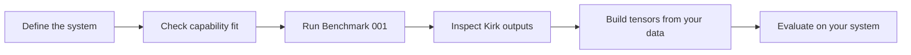

# Start Here

Use this page to decide what to read and what to run.

## The core problem shape

Kirk may be relevant when a system contains multiple streams whose relationships change over time. Examples include market microstructure, industrial telemetry, patient monitoring, cyber telemetry and fusion diagnostics.

The important distinction is between:

- **Point anomaly:** one value is unexpectedly high, low or rare.
- **System-state change:** the joint behaviour of several variables has changed.

A single stream can look ordinary while its relationship with other streams becomes abnormal.

Start with [phenomena discovery](docs/phenomena-discovery.md): build an inspectable record
of what changes and recurs, including behaviours you cannot yet name. Evaluate the value
of acting on those observations separately. Known event labels help validation, but a
predefined taxonomy is not a prerequisite for exploration.

## The developer journey

## Recommended reading order

1. [What is Kirk?](docs/what-is-kirk.md)
2. [Capability fit](docs/capability-fit.md)
3. [Complex systems](docs/complex-systems.md)
4. [Non-stationary data](docs/non-stationary-data.md)
5. [Tensor generation](docs/tensor-generation.md)
6. [Interpreting results](docs/interpreting-results.md)
7. [Benchmark 001](benchmarks/benchmark-001-l2-order-book/README.md)

## The first practical test

Run Benchmark 001. It creates synthetic L2 order-book data containing deliberately introduced operating regimes:

- stable market
- gradual order imbalance
- cancellation-heavy spoofing-like behaviour
- liquidity shock
- recovery

The experiment is designed to test whether Kirk's outputs change near known regime boundaries. The expected-results page describes an evaluation target, not a pre-existing result.

## Before using your own data

Write down:

- the streams available
- their units and sampling rates
- missing-data behaviour
- known regime changes
- the operational decision Kirk should support
- the cost of false positives and missed changes

Without that context, an output curve is easy to over-interpret.
