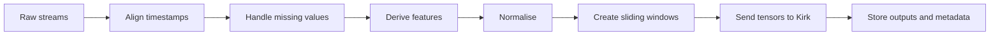

# Tensor Generation

This page defines a reproducible workflow for converting multistream time-series data into 2D tensors for Kirk.

## Canonical shape

```text
tensor shape = window_length × feature_count
```

Example:

```text
256 time steps × 10 features
```

## Required decisions

Document each of the following:

1. Sampling interval
2. Feature order
3. Window length
4. Window stride
5. Normalisation
6. Missing-data policy
7. Clipping or winsorisation
8. Timestamp alignment
9. Warm-up period
10. Metadata attached to each tensor

## Suggested pipeline



## Avoid leakage

For online evaluation, normalisation at time `t` must not use future observations. Use rolling or pre-defined statistics.

## Preserve provenance

Each output should be traceable to:

- source data range
- feature schema version
- tensor index
- start and end timestamps
- preprocessing configuration
- Kirk engine version
- run parameters
